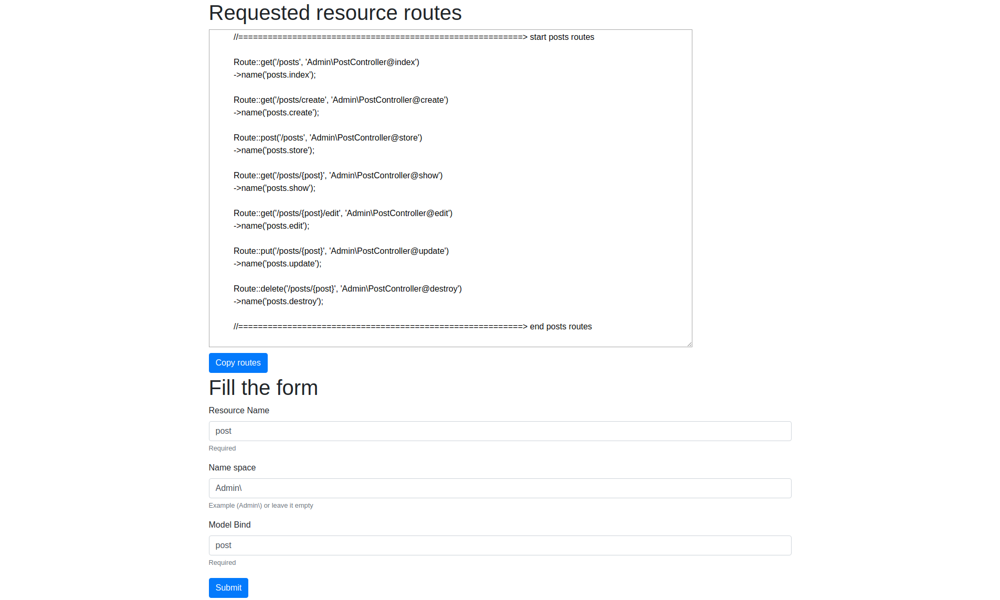

# laravel-resource-routes-generator

<p align="center"></p>

This package allows general resource routes in laravel by providing resource name, namespace and model bind

## Basic usage

open /routes and fill the form and submit then generated routes will appear above the form

## Installation

You can install the package via composer:

```bash
composer require ahmedhelalahmed/laravel-resource-routes-generator
```

## Contributing

Thank you for considering contributing to ahmedhelalahmed/laravel-resource-routes-generator .

### Security

If you discover a security vulnerability within ahmedhelalahmed/laravel-resource-routes-generator , please send an e-mail to Ahmed Helal via ahmed.helal.online@gmail.com. All security vulnerabilities will be promptly addressed.

## Credits

- [Ahmed Helal Ahmed](https://github.com/ahmedhelalahmed)

## License

ahmedhelalahmed/laravel-resource-routes-generator is open-sourced software licensed under the [MIT license](https://opensource.org/licenses/MIT).
